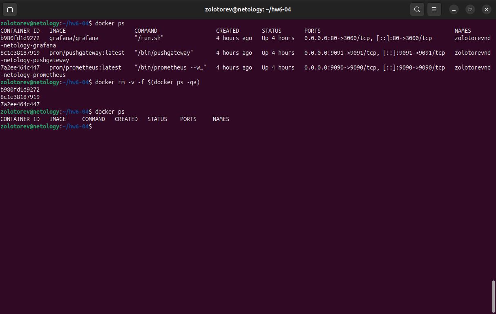

# Домашнее задание к занятию «Docker. Часть 2»
### Золоторев Н.Д.

### Задание 1

Напишите ответ в свободной форме, не больше одного абзаца текста.
Установите Docker Compose и опишите, для чего он нужен и как может улучшить лично вашу жизнь.

### Решение 1

Docker Compose — это инструмент для автоматизации запуска и управления многоконтейнерными приложениями, что значительно упрощает настройку и развертывание сложных систем. Он позволяет описывать все компоненты приложения в одном файле, что делает процесс запуска быстрым и повторяемым. Для меня это особенно полезно, так как позволяет легко тестировать разные окружения, ускоряет разработку и обеспечивает стабильность работы проектов, избавляя от необходимости вручную настраивать каждую часть системы.

### Задание 2

Выполните действия и приложите текст конфига на этом этапе.

Создайте файл docker-compose.yml и внесите туда первичные настройки:

    version;
    services;
    volumes;
    networks.
    
При выполнении задания используйте подсеть 10.5.0.0/16. Ваша подсеть должна называться: <ваши фамилия и инициалы>-my-netology-hw. Все приложения из последующих заданий должны находиться в этой конфигурации.

### Решение 2

### Задание 3

Выполните действия:

    Создайте конфигурацию docker-compose для Prometheus с именем контейнера <ваши фамилия и инициалы>-netology-prometheus.
    Добавьте необходимые тома с данными и конфигурацией (конфигурация лежит в репозитории в директории 6-04/prometheus ).
    Обеспечьте внешний доступ к порту 9090 c докер-сервера.

### Решение 3

### Задание 4

Выполните действия:

    Создайте конфигурацию docker-compose для Pushgateway с именем контейнера <ваши фамилия и инициалы>-netology-pushgateway.
    Обеспечьте внешний доступ к порту 9091 c докер-сервера.

### Решение 4

### Задание 5

Выполните действия:

    Создайте конфигурацию docker-compose для Grafana с именем контейнера <ваши фамилия и инициалы>-netology-grafana.
    Добавьте необходимые тома с данными и конфигурацией (конфигурация лежит в репозитории в директории 6-04/grafana.
    Добавьте переменную окружения с путем до файла с кастомными настройками (должен быть в томе), в самом файле пропишите логин=<ваши фамилия и инициалы> пароль=netology.
    Обеспечьте внешний доступ к порту 3000 c порта 80 докер-сервера.

### Решение 5

### Задание 6

Выполните действия.

    Настройте поочередность запуска контейнеров.
    Настройте режимы перезапуска для контейнеров.
    Настройте использование контейнерами одной сети.
    Запустите сценарий в detached режиме.

### Решение 6

### Задание 7

Выполните действия.

    Выполните запрос в Pushgateway для помещения метрики <ваши фамилия и инициалы> со значением 5 в Prometheus: echo "<ваши фамилия и инициалы> 5" | curl --data-binary @- http://localhost:9091/metrics/job/netology.
    Залогиньтесь в Grafana с помощью логина и пароля из предыдущего задания.
    Cоздайте Data Source Prometheus (Home -> Connections -> Data sources -> Add data source -> Prometheus -> указать "Prometheus server URL = http://prometheus:9090" -> Save & Test).
    Создайте график на основе добавленной в пункте 5 метрики (Build a dashboard -> Add visualization -> Prometheus -> Select metric -> Metric explorer -> <ваши фамилия и инициалы -> Apply.

В качестве решения приложите:

    docker-compose.yml целиком;
    скриншот команды docker ps после запуске docker-compose.yml;
    скриншот графика, постоенного на основе вашей метрики.

### Решение 7

### Задание 8

Выполните действия:

    Остановите и удалите все контейнеры одной командой.

В качестве решения приложите скриншот консоли с проделанными действиями.

### Решение 8

